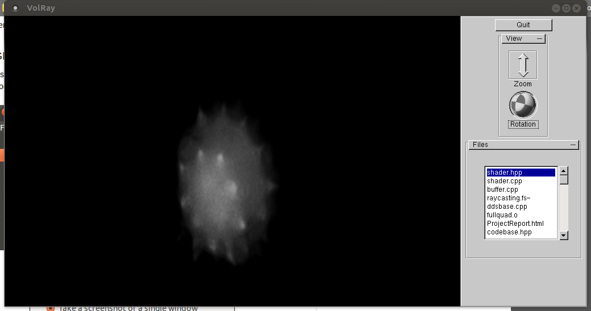

# volume-data-renderer-2013 

## What is it? 
This was for a final project in my undergrad interactive graphics course. The goal was to create an application capable of rendering volume datasets using a raymarching algorithm, including a UI to browse and change datasets. The code dates to December 2013.  

## Build
This was developed on OSX and Linux, has not been tested on Windows (probably unlikely to run on Windows).
```bash
make clean && make -j4 
```

## Running
When you have built the program, run it with the parameters (see below).
```bash
./output PVM_FILE 
```

### Parameters

| Parameter  | Description |
| :--        | :--         |
|                          |
| `PVM_FILE`     | The PVM file representing a dataset. *Must end in .pvm, or the dataset will fail to load!* |

## Results




## Issues
The rendered volume is squished slightly. Small slice artifacts are present.

## Acknowledgements
The code to parse and load PVM files was written by Stefan Roettger, as part of Versatile Volume Viewer. See the copyright disclosures at the top of the source files.

The code in `trackball.cpp` was lifted from [here](https://my.eng.utah.edu/~cs5600/assignments/assign3/cubev.c). It was meant for use in other assignments in the course.

## Works cited
- Roettger, Stefan. (2007) Versatile Volume Viewer [Computer program]. Available at [https://code.google.com/p/vvv/](https://code.google.com/p/vvv/)

- J. Krüger and R. Westerman, “Acceleration Techniques for GPU-based Volume Rendering,” Computer Graphics and Visualization Group, Technical University Munich, Germany, 2003.
